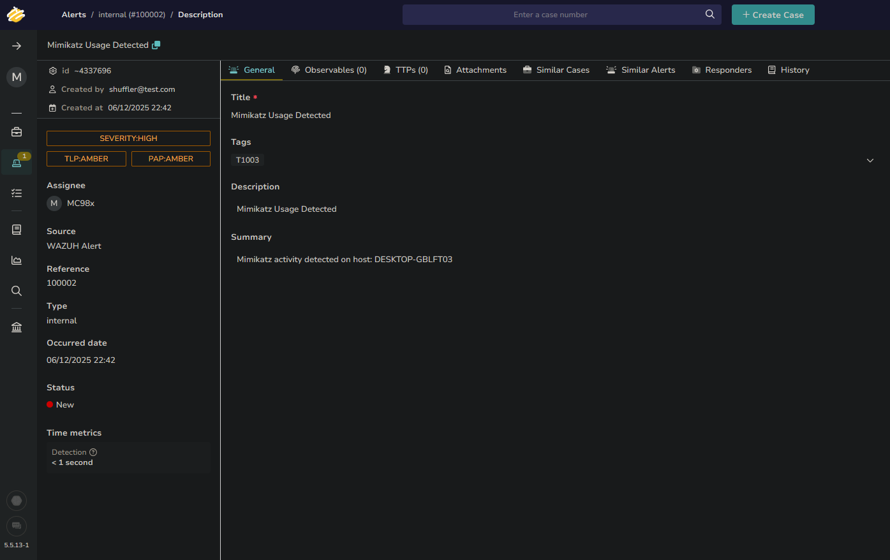
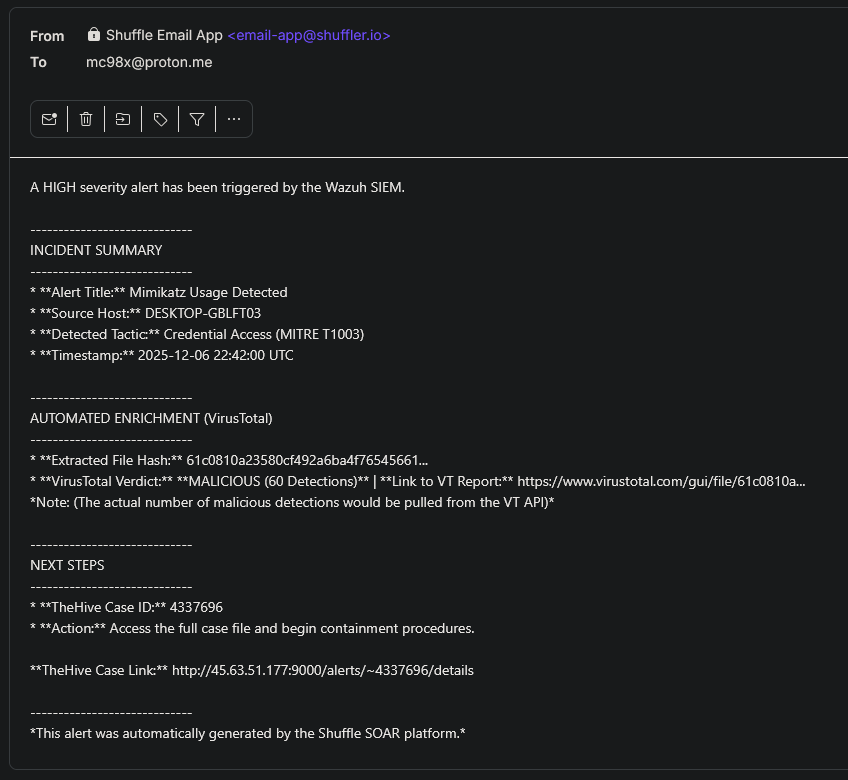

# SOC Automation Lab (Wazuh + Shuffle + TheHive)

**One-liner:** Built a Wazuh + Shuffle pipeline to detect **Mimikatz** via **Sysmon**, extract **SHA256 IOCs**, enrich with **VirusTotal**, and auto-create **TheHive** cases—cutting manual triage **~80%** and delivering alerts **<60s**.

**Stack:** Wazuh • Sysmon • Shuffle (SOAR) • TheHive • VirusTotal • Vultr • Ubuntu • VirtualBox • Windows 11  
**Use case:** Credential dumping (Mimikatz) → detect in SIEM → enrich IOC → open case → notify analyst

## What I Built (Flow)
1. Deployed **Wazuh** (SIEM/XDR) and **TheHive** (case management) on **Vultr** (Ubuntu).
2. Ingested high-fidelity endpoint telemetry with **Sysmon** (Windows 11) → Wazuh.
3. Wrote custom **Wazuh XML** detection to alert on **Mimikatz process behavior**.
4. Triggered **Shuffle** on alert to extract **SHA256** via **Regex** and enrich with **VirusTotal**.
5. Auto-created a **TheHive case** + sent an analyst notification with enriched context.

## Outcomes (Measurable)
- **Alert delivery:** **<60 seconds**
- **Triage reduction:** **~80%** fewer manual steps (copy/paste + enrichment + ticketing)
- **Better context:** VirusTotal verdict + IOC + case link delivered at intake

## Screenshots / Evidence

### Workflow Diagram

### Attack Simulation

### Detection (Wazuh)

### SOAR Orchestration (Shuffle)

### Case Management (TheHive)

### Analyst Notification

## Skills Demonstrated
- **Detection Engineering (Wazuh XML + Sysmon)**
- **SOAR Automation (Shuffle)**
- **Threat Intel Enrichment (VirusTotal)**
- **Case Management (TheHive)**
- **IOC Extraction (Regex / SHA256)**

## Next Improvements
- Add **active response** actions (contain host / kill process) for high-severity detections.
- Add **false-positive checks** (allowlist / signer / known-good hash) before creating cases.
- Expand coverage with **MITRE ATT&CK mapping** and additional TTP-based detections.

## Resources
- **Complete Process Screenshots:** [Full Screenshot Process](./Full-Screenshot-Process)
