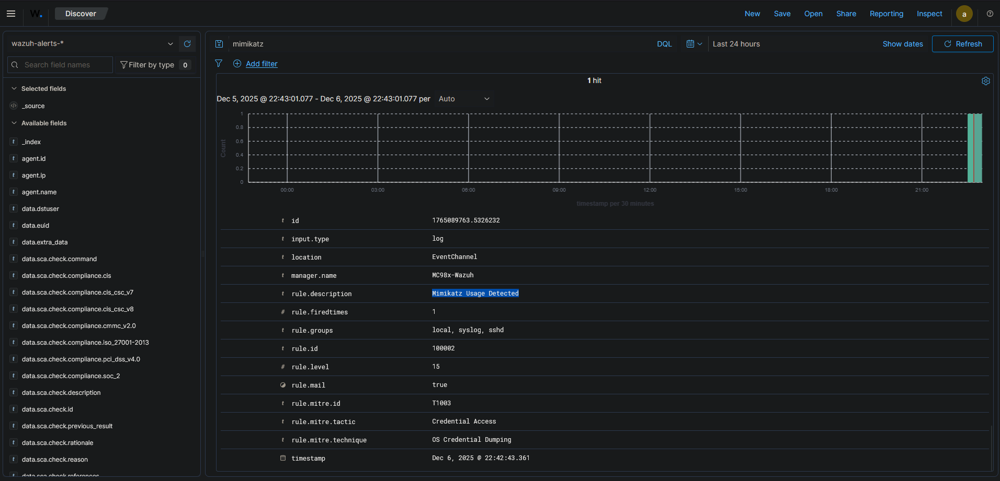
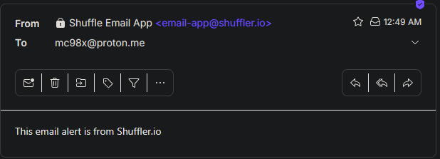

## SOC Automation Project

### Objective
The primary objective of this project was to build a fully functional, cloud-integrated Security Operations Center (SOC) home lab. The project aimed to simulate a real-world enterprise environment to gain hands-on experience in **Detection Engineering**, **Security Orchestration, Automation, and Response (SOAR)**, and **Incident Response**. The workflow involved ingesting telemetry from a target endpoint, detecting a simulated attack, and automatically orchestrating enrichment and alert management.

---

### Skills Learned

**I. Infrastructure & Cloud Administration:**
* **Cloud Deployment:** Provisioned and managed cloud servers on **Vultr** to host the SIEM (Wazuh) and Case Management (TheHive) infrastructure, simulating a hybrid cloud environment.
* **Virtualization:** Configured **VirtualBox** to host a local **Windows 11** target machine, ensuring secure network isolation and resource management.
* **System Hardening & Configuration:** Managed Linux (Ubuntu) services, configured firewalls (**UFW**) to restrict access to specific ports (9000, 55000, 1514), and edited configuration files (YAML, JSON) to integrate disparate systems.

**II. Detection Engineering (SIEM):**
* **Telemetry Ingestion:** Deployed the **Wazuh Agent** on a Windows endpoint and configured it to ingest granular system logs, specifically utilizing **Sysmon** with Olaf Hartong’s configuration for high-fidelity data.
* **Custom Rule Development:** Authored custom **XML detection rules** in Wazuh to specifically identify malicious patterns, such as **Mimikatz** usage (Credential Dumping), by analyzing Sysmon Event IDs (specifically Process Creation).
* **Log Analysis:** Utilized the **Wazuh Dashboard** to query and filter archived logs, verifying the flow of security events from the endpoint to the manager.

**III. Security Orchestration, Automation, and Response (SOAR):**
* **Workflow Automation:** Designed and implemented a SOAR workflow using **Shuffle** to bridge the gap between detection and response.
* **API Integration:** Successfully integrated multiple security APIs (Wazuh, VirusTotal, TheHive) to automate the data flow.
* **Threat Intelligence Enrichment:** Automated the extraction of indicators of compromise (IOCs) such as SHA256 hashes from alerts and enriched them using **VirusTotal** to determine reputation scores.
* **Automated Case Management:** Configured the SOAR playbook to automatically create alerts in **TheHive** and send email notifications to the analyst for high-severity incidents, reducing manual triage time.

**IV. Threat Simulation (Red Team):**
* **Adversary Emulation:** Simulating a Credential Access attack using **Mimikatz** to test the resilience of the detection pipeline.
* **Defense Evasion:** Temporarily disabled Windows Defender and configured exclusions to allow for the execution of offensive tools, understanding how attackers attempt to bypass controls.

---

### Tools Used

**Security Operations Stack:**
* **Wazuh:** SIEM & XDR (Security Information and Event Management)
* **TheHive:** Incident Response & Case Management Platform
* **Shuffle:** Open Source SOAR (Security Orchestration, Automation, and Response)
* **Sysmon:** Advanced Windows System Monitor (Endpoint Telemetry)
* **VirusTotal:** Threat Intelligence & IOC Enrichment

**Infrastructure & Environment:**
* **Vultr:** Cloud Service Provider (Hosting Ubuntu Servers)
* **Oracle VirtualBox:** Type-2 Hypervisor
* **Windows 11 Pro:** Target Endpoint
* **Ubuntu 24.04:** Server OS for Wazuh and TheHive

**Utilities & Languages:**
* **PowerShell:** Agent deployment and troubleshooting
* **RegEx (Regular Expressions):** Parsing logs to extract SHA256 hashes in Shuffle
* **YAML/JSON:** Configuration of filebeat, pipelines, and API integrations

---

### Network Architecture Diagram
to add..

---

### Key Results

**1. Automated Threat Intelligence Enrichment**
By integrating **Shuffle (SOAR)** with **Wazuh** and **VirusTotal**, the lab automatically extracted SHA256 hashes from security alerts. This eliminated the need for manual copy-pasting into reputation checkers, instantly providing the analyst with a "Malicious" or "Clean" verdict alongside the alert.

**2. High-Fidelity Threat Detection**
Successfully bypassed standard noise by configuring **Sysmon Event ID 1 (Process Creation)** to trigger a custom Wazuh alert only when the specific `mimikatz.exe` binary or known malicious arguments were detected. This proved the ability to tune SIEM rules for specific TTPs rather than relying solely on default rule sets.

**3. Reduced Mean Time to Respond (MTTR)**
The automation workflow reduced the time between "Attack Execution" and "Analyst Notification" to less than **60 seconds**.
* **Without Automation:** Analyst sees alert -> Log in to SIEM -> Copy Hash -> Check VirusTotal -> Open Ticketing System -> Create Ticket. (~10-15 Minutes)
* **With Automation:** Attack occurs -> Analyst receives Email with Ticket ID and VirusTotal Score immediately. (< 1 Minute)
---
### Screenshots

#### 1. The Attack: Mimikatz Execution
*Simulating a credential dumping attack on the Windows 11 endpoint using PowerShell. This generates the raw telemetry required for detection.*

#### 2. The Detection: Wazuh Security Events
*The Wazuh Manager successfully ingesting the Sysmon logs and triggering the custom "Mimikatz Usage Detected" alert based on the XML rule configuration.*

#### 3. The Orchestration: Shuffle SOAR Workflow
*The automated playbook in action. This visualizes the data flow from the Wazuh Alert (Webhook) -> Regex Hash Extraction -> VirusTotal API Lookup -> TheHive Case Creation.*

#### 4. The Response: TheHive Case Management
*The final output where the incident is logged. The alert includes the enriched data (VirusTotal score) allowing for immediate triage decisions.*

#### 5. Analyst Notification: Real-Time Email
*An example of the email alert sent to the SOC Analyst, containing the critical "What, Where, and When" details without needing to log into the dashboard.*

---

### Future Improvements
To further evolve this project into an enterprise-grade monitoring solution, the following enhancements are planned:
* **Active Response:** Configure Wazuh to automatically trigger active response scripts (e.g., isolating the host or killing the malicious process) immediately upon detecting a high-severity threat.
* **Expanded Playbooks:** Create complex Shuffle workflows that handle false positives by checking against a known-good allowlist before creating an alert.
* **Network Security Monitoring (NSM):** Integrate **Suricata** or **Zeek** to correlate host-based logs with network-level traffic analysis for a layered defense approach.
* **MITRE ATT&CK Mapping:** Map all custom detection rules to the MITRE ATT&CK framework to visualize coverage gaps and prioritize future detection logic.

---

### Conclusion
This SOC Automation Project demonstrates a comprehensive understanding of the modern security lifecycle. By moving beyond simple log aggregation to building a fully automated detection and response pipeline, I established a system that not only identifies threats like **Mimikatz** but also handles the "heavy lifting" of triage through **SOAR**. 

This project proves my ability to:
1.  **Architect** and maintain a complex, hybrid-cloud security infrastructure.
2.  **Engineer** high-fidelity detection rules based on behavior (TTPs) rather than just signatures.
3.  **Automate** repetitive analyst tasks using API integrations, directly translating to improved **Mean Time to Respond (MTTR)** in a professional SOC environment.

These skills—infrastructure management, detection engineering, and automation logic—are directly applicable to the daily responsibilities of a **SOC Analyst** and showcase a readiness to contribute effectively to a security operations team.

---

### Resources and Documentation

To review the full build process and configuration details

* **Complete Process Screenshots:** [Full Screenshot Process](./Full-Screenshot-Process)
